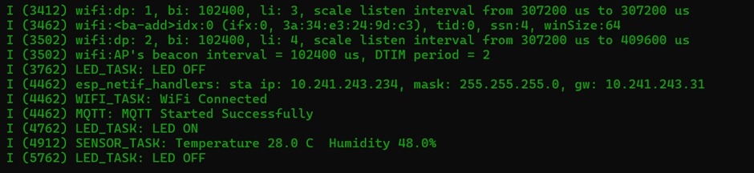

# FreeRTOS Based Real Time Environmental Monitoring System with Watchdog Assisted Fault Tolerance and MQTT Enabled IoT Communication

## Abstract

This project presents a real time embedded environmental monitoring system designed using a FreeRTOS based multitasking architecture with integrated watchdog supervision and MQTT enabled IoT communication. The system demonstrates concurrent task scheduling for sensing, wireless communication, system health monitoring, and status indication while maintaining deterministic timing behavior. A watchdog protection mechanism enhances reliability by detecting stalled tasks and maintaining operational stability. Sensor telemetry is transmitted through the lightweight MQTT publish subscribe protocol, enabling scalable remote monitoring and IoT integration. The project highlights principles of real time embedded design, fault tolerant firmware architecture, and reliable wireless communication suitable for industrial IoT and embedded research applications.

## Introduction

Real time embedded systems require deterministic scheduling, reliability, and efficient communication mechanisms. With the increasing demand for IoT enabled monitoring systems, combining real time operating systems with network communication protocols has become essential. This project demonstrates how FreeRTOS based task management, watchdog monitoring, and MQTT communication can be integrated into a stable embedded firmware architecture for environmental monitoring applications.

## Objectives

Design a multitasking embedded system using FreeRTOS

Implement reliable system monitoring using watchdog supervision

Acquire environmental sensor data periodically

Transmit telemetry using MQTT communication protocol

Demonstrate concurrent execution of sensing, communication, and system tasks

Provide a scalable firmware architecture for IoT applications

## System Architecture

The system consists of multiple real time tasks:

#### Sensor Task
Periodically acquires environmental data such as temperature and humidity.

#### WiFi Communication Task
Establishes wireless connectivity and manages network communication.

#### MQTT Task
Publishes sensor telemetry to an MQTT broker using a lightweight publish subscribe model.

#### LED Status Task
Provides system activity indication for debugging and monitoring.

#### System Watchdog Task
Monitors task execution health and ensures system reliability.

These tasks operate concurrently under the FreeRTOS scheduler.

## Real Time Operating System Implementation

FreeRTOS is used for:

Task scheduling

Priority based execution

Inter task coordination

Deterministic timing control

System reliability monitoring

The multitasking structure ensures responsiveness and efficient resource utilization.

## Watchdog Reliability Mechanism

A task watchdog timer is integrated to ensure system stability.

The watchdog detects stalled or unresponsive tasks and prevents system freeze conditions.

This improves reliability for long duration continuous monitoring applications.

## MQTT Communication Framework

MQTT is used as a lightweight IoT communication protocol due to:

Low bandwidth usage

Efficient publish subscribe communication

Scalability for cloud integration

Minimal processing overhead

Sensor data is published periodically to an MQTT broker, enabling remote monitoring and IoT expansion.

## Experimental Results

Successful concurrent task execution under FreeRTOS

Reliable periodic sensor data acquisition

Stable WiFi connectivity and MQTT communication

Effective watchdog supervision ensuring system robustness

Real time telemetry publishing capability

## Project Output

### Hardware Setup

### Serial Monitor Output

### Boot Logs

### MQTT 

## Applications

Industrial environmental monitoring

Smart home automation nodes

IoT sensor gateways

Embedded communication research platforms

Remote telemetry systems

## Future Scope

Cloud dashboard integration for visualization

Secure MQTT communication with encryption

Edge analytics for local processing

Power optimization for battery operation

Industrial scale IoT deployment

## Technologies Used

FreeRTOS Real Time Operating System

Embedded C Firmware Development

MQTT Communication Protocol

Wireless Networking

Embedded Sensor Interfacing

## Repository Structure

main folder contains application tasks

components folder contains sensor drivers and communication modules

build folder contains compiled firmware artifacts

README contains project documentation

## Conclusion

This project demonstrates the integration of real time operating system principles, watchdog based reliability, and MQTT communication into a unified embedded monitoring platform. The implementation highlights deterministic task scheduling, fault tolerant system design, and scalable IoT communication architecture suitable for advanced embedded applications and research oriented developments.

