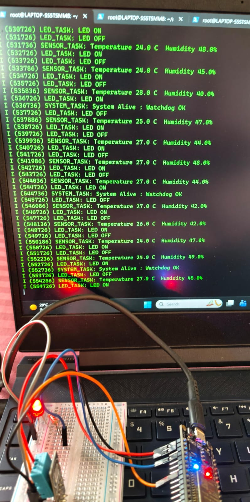
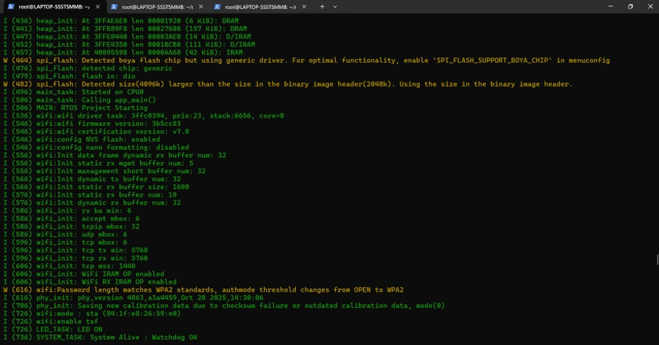
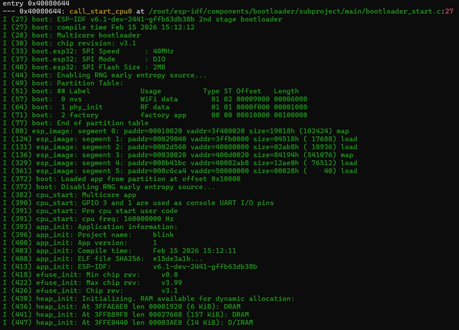

# EmbedTrack RTOS

ESP32 FreeRTOS based embedded system project demonstrating:

• Multi-tasking using FreeRTOS  
• WiFi connectivity monitoring  
• Task watchdog supervision  
• LED control task  
• Temperature and humidity sensing (DHT11)  
• Multicore scheduling on ESP32  

## Features
- Real-time task scheduling
- Watchdog monitoring for system stability
- WiFi event handling
- Sensor data logging
- Embedded RTOS architecture demonstration

## Hardware
ESP32 Dev Board  
DHT11 Sensor  
LED  

## Software
ESP-IDF v6.x  
FreeRTOS  
Embedded C  

## How to Run
idf.py build  
idf.py flash monitor

## Project Output

### Hardware Setup

### Serial Monitor Output

### Boot Logs

## Author
Jiya Kulkarni

